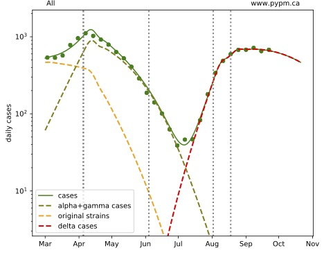
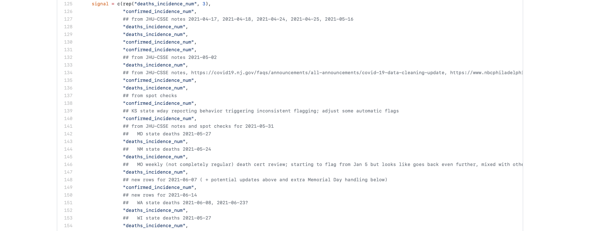

class: middle

```{r setup, include=FALSE}
library(tidyverse)
library(lubridate)
library(covidcast)
pro = fontawesome::fa("thumbs-up", fill="green")
con = fontawesome::fa("bomb", fill="orange")
options(htmltools.dir.version = FALSE)
knitr::opts_chunk$set(
  dev = "svg",
  fig.width=9, fig.height=3.5, fig.retina=3,
  fig.showtext = TRUE,
  out.width = "100%",
  cache = TRUE,
  echo = FALSE,
  message = FALSE, 
  warning = FALSE,
  hiline = TRUE
)
```

```{r xaringan-themer, include=FALSE, warning=FALSE}
library(xaringanthemer)
primary = "#654ea3"
secondary = "#F9AC2F"
tertiary = "#0076A5"
fourth_color = "#DB0B5B"

style_duo_accent(
  primary_color      = primary,  #"#002145", # UBC primary
  secondary_color    = secondary,  #"6EC4E8", # UBC secondary 4
  header_font_google = google_font("EB Garamond"),
  text_font_google = google_font("Open Sans"),
  code_font_google = google_font("Fira Mono"),
  table_row_even_background_color = lighten_color(primary, 0.8),
  colors = c(
    tertiary = tertiary, fourth_color = fourth_color,
    light_pri = lighten_color(primary, 0.8),
    light_sec = lighten_color(secondary, 0.8),
    light_ter = lighten_color(tertiary, 0.8),
    light_fou = lighten_color(fourth_color, 0.8)
    ),
  title_slide_background_image = "corona.jpeg",
  #title_slide_background_position = "75% 75%",
  #title_slide_background_size = "200px 200px"
  title_slide_text_color = "#FFFFFF"
)
# theme_set(theme_xaringan())
```


.pull-left[.center[

]]

.pull-right[.center[


]]


---

## BC COVID Modelling Group

.left-column[

### Personnel

Prof. Dan Coombs

Prof. Sally Otto

Prof. Caroline Colijn

Prof. Dean Karlen

Prof. Eric Cytrynbaum 

Jens von Bergmann

Others 
]

--

.right-column[

### Goals

Mainly volunteers interested and motivated by understanding COVID-19.

Began more as a research group with invited speakers.

Still focused on "understanding" local issues, providing a perspective on the situation that might help policy. 

A focus on counterfactual mathematical modeling.

Strong connection to local/national journalists (esp. Sally and Caroline).

Began releasing reports every other week.

**Big emphasis on data issues/availability**
]

---

## Delphi

### History

* [Delphi](https://delphi.cmu.edu/) Formed in 2012, to "develop theory and practice of epi forecasting".

* Participated in annual CDC influenza forecasting challenges since 2013, and earned top place in several. 

* Awarded **CDC National Center of Excellence** for flu forecasting in 2019.

* Pivoted in February 2020 to focus on supporting the US COVID-19 response, launched [COVIDcast project](https://delphi.cmu.edu/covidcast/).

--

### Goals

**The full pipeline:**

1. Find, collect, disseminate the data we need.
1. Use the data to: model, forecast, nowcast, answer the big questions.
1. Create software for the community.
1. Advance research.
1. Influence policymakers.
1. Communicate broadly.


---

## Delphi personnel

.left-column[
 

**Roni Rosenfeld**  
CMU MLD


**Ryan Tibshirani**  
CMU MLD + Stat
]

--

.center[

]


---

## To understand COVID-19, we need data

```{r, include=FALSE}
money = fontawesome::fa("money-bill-wave", fill="green", height="2em")
```

.pull-left[
### Canada

`r pro` Centralized Health Care

`r pro` Regularized reporting

`r pro` `r con` Huge emphasis on privacy

`r con` Relatively underfunded.

`r money` goes to the "right places"

]

.pull-right[
### USA

`r con` Decentralized Health Care

`r con` Massively irregular reporting

`r pro` `r con` Occasional emphasis on "privacy"

`r pro` Massively overfunded.

`r money` `r money` `r money` goes to the all the wrong places

]

<hr>

--


<br/>


.center[.large[**Data Collection and Quality Is A Major Issue**]]

--

.center[.large[**The Necessary Data Depends on your Goals**]]

---
class: inverse, middle, center

# Standard epidemic models


---
layout: true

## SIR-type (compartmental) models - Stochastic Version

---

(Borrowed heavily from [Cosma Shalizi](http://www.stat.cmu.edu/~cshalizi/dst/20/lectures/20/lecture-20.html), Ryan Tibshirani, [Dean Karlen](https://pypm.github.io/home/docs/studies/reports/Characterizing_spread.pdf))

Population of size N

.pull-left[
Suppose every member in a bucket at time t:

1. .primary[Susceptible] $S(t)$ : not sick, but could get sick
1. .secondary[Infected] $I(t)$ : sick, can make others sick
1. .tertiary[Removed] $R(t)$ : either recovered or dead; not sick, can't get sick, can't make anyone sick


Bucket Jumping (small increment h):

1. During h, each .primary[s] meets kh people.
1. Prob( .primary[s] meets .secondary[i] and becomes .secondary[i] ) = c.
1. So Prob( .primary[s] becomes .secondary[i] ) = $1 - (1 - c I(t)  / N )^{hk} \approx kchI(t) / N$
1. New .secondary[i] in time h $\sim Binom(S(t),\ kchI(t) / N)$
1. Prob( .secondary[i] becomes .tertiary[r]) = $\gamma h$, so new removals in time h $\sim Binom(I(t),\ \gamma h)$


]

.pull-right[
```{r sir-dag, echo = FALSE}
library(visNetwork)
library(widgetframe)
sir <- tibble(id = 1:3, label = c(" S ", " I ", " R "), shape = "circle",
              color = c(primary, secondary, tertiary))
sire <- tibble(from = 1:2, to = 2:3, arrows = "to")
visNetwork(sir, sire) %>%
  visNodes(font = list(color = "#FAFAFA", size = 32)) %>%
  visHierarchicalLayout(direction = "LR") %>%
  frameWidget()
```
]


---

.pull-left-wide[

### Over-all equations:

\begin{aligned}
C(t+h) & =  \mathrm{Binom}\left(S(t),\ \frac{\beta}{N} h I(t)\right)\\
D(t+h) & =  \mathrm{Binom}\left(I(t),\ \gamma h\right)\\
S(t+h) & =  S(t) - C(t+h)\\
I(t+h) & =  I(t) + C(t+h) - D(t+h)\\
R(t+h) & =  R(t) + D(t+h)
\end{aligned}

### In the deterministic limit, $N\rightarrow\infty,\ h\rightarrow 0$

\begin{aligned}
N &= S(0) + I(0) + R(0)\\
\frac{dS}{dt} & =  -\frac{\beta}{N} S(t)I(t)\\
\frac{dI}{dt} & =  \frac{\beta}{N} I(t)S(t) - \gamma I(t)\\
\frac{dR}{dt} & =  \gamma I(t)
\end{aligned}

**"_the_ SIR model"** often ambiguous between the stochastic model and these ODEs

]

.pull-right-narrow[
```{r sir-dag-again, echo = FALSE}
visNetwork(sir, sire) %>%
  visNodes(font = list(color = "#FAFAFA", size = 32)) %>%
  visHierarchicalLayout(direction = "UD") %>%
  frameWidget()
```

]

---
layout: false

## Data issues 

- **Ideally** we'd see $S(t), I(t), R(t)$ (or any 2) at all times

- Easier to observe new infections, $I(t+h) - I(t)$, than current total infections, $I(t)$

- Removals by death are easier to observe than removals by recovery, so we mostly see $(R(t+h)-R(t))\times (\mathrm{death\ rate})$

- The interval between measurements, say $\Delta$, is often $\gg h$

- Measuring $I(t)$ and $R(t)$ (or their rates of change) is hard since testing/reporting is sporadic and error prone
    + Need to model test error (false positives, false negatives) _and_ who gets tested
    + Need to model lag between testing and reporting
    
- Parameters (especially, but not just $\beta$) change during the epidemic
    + Changing behavior, changing policy, environmental factors, vaccines, variants, ...

---
layout: true

## Connecting to Data

---

- Likelihood calculations are straightforward if we can measure $I(t), R(t)$ at all times $0, h, 2h \ldots T$
    + Or $I(0), R(0)$ and all the increments $I(t+h)-I(t), R(t+h) - R(t)$
	+ Still have to optimize numerically

- Likelihood calculations already become difficult if the time between observations $\Delta \gg h$
    + Generally, $\Delta \approx$ 1 day
    + In principle, this just defines another Markov process, with a longer interval $\Delta$ between steps, but to get the likelihood of a $\Delta$ step we have to sum over all possible paths of $h$ steps adding up to it

- Other complications if we don't observe all the compartments, and/or have a lot of noise in our observations
    + We don't and we do.

---

.pull-left[

- Often more tractable to avoid likelihood  (Conditional least squares, simulation-based inference)

- Intrinsic issue: Initially, everything just looks exponential
    + So it's hard to discriminate between distinct models
    + So even assuming an SIR model, it's easier to estimate $\beta - \gamma$ than $(\beta, \gamma)$ or $\beta/\gamma$

- Can sometimes **calibrate** or fix the parameters based on other sources
    + E.g., $1/\gamma =$ average time someone is infectious, which could be determined from clinical studies / observations
]

.pull-right[
<blockquote class="twitter-tweet"><p lang="en" dir="ltr">I have been thinking about how different people interpret data differently. And made this xkcd style graphic to illustrate this. <a href="https://t.co/a8LvlmZxT7">pic.twitter.com/a8LvlmZxT7</a></p>&mdash; Jens von Bergmann (@vb_jens) <a href="https://twitter.com/vb_jens/status/1372251931444350976?ref_src=twsrc%5Etfw">March 17, 2021</a></blockquote>
]


---
layout: false

## BC COVID Compartmental Models

.pull-left[.midi[

Two main models

- Caroline Colijn (and team) [COVIDSEIR](https://seananderson.github.io/covidseir/index.html)
    * Uses the ODE version
    * Extra compartments for social distancing, others
    * Severity "ramp" on $\beta$
    * Likehood evaluation using R / Stan
    * Versions for age, a number of other things
    
- Dean Karlen [pyPM](https://pypm.github.io/home/)
    * Discrete difference version
    * Extra compartments for VOCs, Hospitalizations, deaths, ICU, others
    * Estimated with Conditional Least Squares
    * Includes "Case Injections", estimated and forced changes in $\beta$
    * (Really a whole `python` package for creating compartmental models)
    
- Both model reporting delays, seasonality
- Other Bells and Whistles I'm not doing justice
]]

.pull-right[



.small[.center[Source: [Dean Karlen](https://github.com/pypm/home/blob/master/docs/studies/bc20210928/img/bc_2_9_0928.pdf) September 28 model fit to all BC]]
]

---

## These models fit well "in sample"

.pull-left[
* Track observed cases closely (they should)

* Can provide nuanced policy advice on some topics

* Many questions depend on modulating $\beta$
    1. What happens if we lock down?
    2. What happens if we mask?
    3. What happens if we have school online?
    4. Vaccine passport?
    
* Vaccination modeling is easier, directly removes susceptibles

* What about out-of-sample?
]

--

.pull-right[.center[
`r fontawesome::fa("exclamation-circle", fill="orange", height="20em")`
]]

---
background-image: url("covidseir-fcast.pdf")
background-position: center
background-size: contain

---
background-image: url("pypm-fcast.pdf")
background-position: center
background-size: contain


---
class: inverse, middle, center

# Out-of-sample COVID Forecasting

---
## The task

* Every week, submit forecasts to [COVID-19 **Forecast**Hub](https://covid19forecasthub.org)

* We have now submitted 52 such forecasts (first on July 20, 2020)!

* Originally "State Deaths", added "County Cases" a bit later, and eventually "Hospitalizations"

* Hub also collects (now) a few other targets

--

### The goal

* Forecasts from many teams are combined into an "ensemble"

* The ensemble generally has the best performance, and is the official CDC Forecast

---

## The forecasters

.pull-left[
* SIR, Agent-based models, ML models

* Ours are (simple) ML

* Some do pretty well, but many are ...
]

.pull-right[

* "point" forecasts and "quantiles"

* Predict 1-4 epiweeks ahead

* Some teams produce longer-term forecasts ...
]


```{r}
source("ca-trajectory.R")
ca_traj
```

---

## Forecast evaluation

[Weighted Interval Score (Bracher et al., 2000)](https://arxiv.org/abs/2005.12881)

.pull-left[
* Calculated for each target   
(forecast date, location, horizon)

* For each Interval:
    1. Width of interval.
    1. Under prediction (AE to the top)
    1. Over prediction (AE to the bottom)

* Weighted average using probability content

* Mathematically equivalent to an average of quantile losses

* Discrete approximation of CRPS
]

.pull-right[

```{r, fig.width=4}
ca_traj
```

]

---

## Comparing across space and time

```{r setup-aws}
library(aws.s3)
Sys.setenv("AWS_DEFAULT_REGION" = "us-east-2")
s3bucket <- get_bucket("forecast-eval")
death_scores <- s3readRDS("score_cards_state_deaths.rds", s3bucket) %>%
  select(ahead:forecaster, target_end_date, wis) %>%
  mutate(forecast_date = target_end_date - 7 * ahead)
dump <- death_scores %>% group_by(forecaster) %>% summarise(n = n()) %>%
  filter(n > 4 * 4 * 50 * 4, forecaster != "COVIDhub-ensemble")
death_scores <- death_scores %>% 
  filter(forecaster %in% pull(dump, forecaster))

baseline <- death_scores %>% filter(forecaster == "COVIDhub-baseline")
death_scores <- left_join(
  death_scores %>% filter(forecaster != "COVIDhub-baseline"),
  baseline %>% rename(base_wis = wis) %>% 
    select(forecast_date, target_end_date, geo_value, base_wis),
)
```


.pull-left[

* Error proportional to cases

* Large right skew

* "Adjust" by scaling to a Baseline

* Baseline is flat line + residual quantiles

```{r wis-map, fig.width=2.75, fig.height=2}
Mean <- function(x) mean(x, na.rm = TRUE)
GeoMean <- function(x, y = NULL, offset = 0) {
  x <- x + offset
  if (!is.null(y)) y <- y + offset
  else y <- 1
  exp(Mean(log(x / y)))
}
cmu_death_map <- death_scores %>%
  filter(forecaster == "CMU-TimeSeries", ahead == 3) %>%
  group_by(geo_value) %>%
  summarize(value = Mean(wis)) %>%
  mutate(time_value = Sys.Date()) %>%
  as.covidcast_signal(signal = "wis", data_source = "CMU-TimeSeries",
                      geo_type = "state")

plot(cmu_death_map, choro_col = scales::viridis_pal()(3), 
     title = "Mean of WIS (all CMU forecasts)") + 
  theme_void(base_size = 8) + 
  theme(legend.position = "bottom", legend.margin = margin(0,1,0,1,"cm"))

```

]

.pull-right[


```{r wis-densities, fig.width=4}
death_scores %>%
  filter(ahead == 3) %>%
  ggplot(aes(wis, fill = forecaster, color = forecaster)) + 
  geom_density(alpha = .2) +
  scale_fill_viridis_d() +
  scale_color_viridis_d() +
  theme_bw() +
  theme(legend.position = "none") +
  scale_x_log10(labels = scales::label_number_si()) +
  coord_cartesian(xlim = c(.1, 1e5))
```


]

---

## Performance over time (Incident Deaths)

```{r death-scores-all, fig.height=4.5}
library(gghighlight)
selected <- c("COVIDhub-4_week_ensemble", "Karlen-pypm", "CMU-TimeSeries",
              "COVIDhub-trained_ensemble")
death_scores %>%
  group_by(forecaster, target_end_date, ahead) %>%
  summarise(relwis = GeoMean(wis, base_wis, offset = 1)) %>%
  ggplot(
    aes(target_end_date, relwis, color = forecaster, group = forecaster)) +
  facet_wrap(~ahead, labeller = label_both) +
  geom_line() +
  geom_hline(yintercept = 1, color = "black", size = 1.5) +
  gghighlight(forecaster %in% selected, use_direct_label = FALSE) +
  ylab("Geometric Mean of WIS\n relative to baseline") +
  xlab("Target date") +
  theme_bw() +
  coord_cartesian(ylim = c(.5, 2)) +
  scale_color_viridis_d(begin = .1, end = .85, option = "A") +
  theme(legend.position = "bottom", legend.title = element_blank())
```

---

## Overall performance (Incident Deaths)
#### All forecasters with at least 4 months of submissions

```{r overall-death, fig.height=4}
death_scores %>%
  group_by(forecaster, ahead) %>%
  summarise(relwis = GeoMean(wis, base_wis, offset = 1)) %>%
  ggplot(
    aes(ahead, relwis, color = forecaster)) +
  geom_line() +
  geom_hline(yintercept = 1, color = "black", size = 1.5) +
  gghighlight(forecaster %in% selected, 
              label_params = list(min.segment.length = Inf)) +
  ylab("Geometric Mean of WIS\n relative to baseline") +
  xlab("Weeks ahead") +
  theme_bw() +
  scale_color_viridis_d(begin = .1, end = .85, option = "A")
```

---

## What about Incident Cases?

```{r grab-cases}
case_scores <- s3readRDS("score_cards_state_cases.rds", s3bucket) %>%
  select(ahead:forecaster, target_end_date, wis) %>%
  mutate(forecast_date = target_end_date - 7 * ahead)
dumpc <- case_scores %>% group_by(forecaster) %>% summarise(n = n()) %>%
  filter(n > 4 * 4 * 50 * 4, forecaster != "COVIDhub-ensemble")
case_scores <- case_scores %>% 
  filter(forecaster %in% pull(dumpc, forecaster))
base_case <- case_scores %>% filter(forecaster == "COVIDhub-baseline")
case_scores <- left_join(
  case_scores %>% filter(forecaster != "COVIDhub-baseline"),
  base_case %>% rename(base_wis = wis) %>% 
    select(forecast_date, target_end_date, geo_value, base_wis)) %>% 
  group_by(forecaster, ahead) %>%
  summarise(relwis = GeoMean(wis, base_wis, offset = 1))
```

```{r overall-cases, fig.height=4.5}
ggplot(case_scores,
    aes(ahead, relwis, color = forecaster)) +
  geom_line() +
  geom_hline(yintercept = 1, color = "black", size = 1.5) +
  gghighlight(forecaster %in% selected, use_direct_label = FALSE) +
  ylab("Geometric Mean of WIS\n relative to baseline") +
  xlab("Weeks ahead") +
  theme_bw() +
  scale_color_viridis_d(begin = .1, end = .85, option = "A") +
  theme(legend.position = "bottom", legend.title = element_blank())
```

---

## Predicting surges in Florida

<iframe src="https://ubc-stat-dajmcdon.shinyapps.io/fl-fcast-visualizer/" width="100%" height="700px" style="border:none"></iframe>

---

## PI Coverage

```{r coverage-plot, fig.height=4.5}
case_cov <- readRDS("cases-coverage.rds")
death_cov <- readRDS("deaths-coverage.rds")
bind_rows(cases = case_cov, deaths = death_cov, .id = "target") %>%
  ggplot(aes(target_end_date, cov, color = forecaster)) +
  geom_line() + geom_point(size = .25) +
  geom_hline(yintercept = 0.95, linetype = "dashed") +
  scale_y_continuous(name = "95% PI coverage", limits = c(0,1)) +
  scale_x_date(date_breaks = "6 months", date_labels = "%b %Y") +
  xlab("Target date of forecast") +
  scale_color_viridis_d(begin = .1, end = .9) +
  theme(legend.position = "none") +
  facet_grid(target ~ ahead, 
             labeller =  labeller(ahead = label_both)) +
  theme_bw() +
  theme(legend.position = "bottom", legend.title = element_blank())
```

---
layout: true

## The terrible case of Ohio

```{r oh-asof, fig.height=4.5}
oh_final <- covidcast::covidcast_signal(
  "jhu-csse", "deaths_7dav_incidence_num", geo_type = "state", 
  geo_values = "oh") %>% 
  select(time_value, value)
oh_15 <- covidcast::covidcast_signal(
  "jhu-csse", "deaths_7dav_incidence_num", geo_type = "state", 
  geo_values = "oh", as_of = "2021-02-15") %>%
  select(time_value, value) %>%
  rename(`Feb 15` = value)
oh_20 <- covidcast::covidcast_signal(
  "jhu-csse", "deaths_7dav_incidence_num", geo_type = "state", 
  geo_values = "oh", as_of = "2021-02-20") %>%
  select(time_value, value) %>%
  rename(`Feb 20` = value)
oh_31 <- covidcast::covidcast_signal(
  "jhu-csse", "deaths_7dav_incidence_num", geo_type = "state", 
  geo_values = "oh", as_of = "2021-03-01") %>% 
  select(time_value, value) %>%
  rename(`Mar 1` = value)
oh <- left_join(oh_final %>% rename(today = value), oh_31) %>% 
  left_join(oh_15) %>% left_join(oh_20) %>%
  pivot_longer(-time_value)
```

---

```{r plot-oh, fig.height=4.5}
ggplot(oh, aes(time_value, value, color = name)) +
  geom_line() +
  ylab("OH Daily Deaths\n7-day trailing average") +
  xlab("Date") +
  theme_bw() +
  theme(legend.position = "bottom", legend.title = element_blank()) +
  scale_color_brewer(palette = "Set1") +
  coord_cartesian(xlim = ymd("2020-11-01", "2021-03-01")) +
  geom_vline(xintercept = ymd("2021-02-15"), linetype = "dashed")
```

---

```{r bad-forecast, fig.height=4.5, message=FALSE}
ugh <- get_covidhub_predictions(
  "epiforecasts-ensemble1", "2021-02-15", 
  signal = "deaths_incidence_num", geo_values = "oh")
ugh <- ugh %>% filter(is.na(quantile) | 
                        abs(quantile - .025) < 1e-3 |
                        abs(quantile - .975) < 1e-3) %>%
  mutate(hlp = case_when(
    is.na(quantile) ~ "point",
    abs(quantile - .025) < 1e-4 ~ "lo",
    TRUE ~ "hi"
  )) %>%
  select(target_end_date, value, hlp) %>%
  pivot_wider(names_from = hlp, values_from = value)
ggplot() +
  geom_line(data = oh_final %>% 
              mutate(geo_value = "oh") %>% 
              evalcast:::sum_to_epiweek(), aes(time_value, value)) +
  geom_line(data = oh_15 %>% 
              mutate(geo_value = "oh") %>% 
              rename(value = `Feb 15`) %>%
              evalcast:::sum_to_epiweek() %>%
              filter(time_value < "2021-02-16"), 
            aes(time_value, value),
            color = "grey50") +
  geom_point(data = oh_final %>% 
         mutate(geo_value = "oh") %>% 
         evalcast:::sum_to_epiweek(), aes(time_value, value)) +
  geom_line(data = ugh, aes(target_end_date, point), color = primary) +
  geom_point(data = ugh, aes(target_end_date, point), color = primary) +
  # geom_ribbon(data = ugh, 
  #             aes(x = target_end_date, ymin = lo, ymax = hi), 
  #             fill = primary, alpha=.4) +
  scale_y_log10(labels = scales::label_number_si(), 
                name = "Total Deaths per week") +
  scale_x_date(name = "Date", date_labels = "%b %Y") +
  geom_vline(xintercept = ymd("2021-02-15"), linetype = "dashed") +
  coord_cartesian(xlim = ymd("2020-11-01", "2021-04-01")) +
  theme_bw()
```

---
layout: false
class: inverse, middle, center

# Forecasting lessons

---
layout: true

## Forecasting lessons

---

Simple models [M,Bien,Green,Hu,...Tibs](http://medrxiv.org/content/10.1101/2021.06.22.21259346v1)

```{r}
case_scores <- s3readRDS("score_cards_state_cases.rds", s3bucket) %>%
  select(ahead:forecaster, target_end_date, wis) %>%
  mutate(forecast_date = target_end_date - 7 * ahead)
dumpc <- case_scores %>% group_by(forecaster) %>% summarise(n = n()) %>%
  filter(n > 4 * 4 * 50 * 4, forecaster != "COVIDhub-ensemble")
case_scores <- case_scores %>% 
  filter(
    forecaster %in% pull(dumpc, forecaster), forecast_date < "2021-04-01")
base_case <- case_scores %>% filter(forecaster == "COVIDhub-baseline")
case_scores <- left_join(
  case_scores %>% filter(forecaster != "COVIDhub-baseline"),
  base_case %>% rename(base_wis = wis) %>% 
    select(forecast_date, target_end_date, geo_value, base_wis)) %>% 
  group_by(forecaster, ahead) %>%
  summarise(relwis = GeoMean(wis, base_wis, offset = 1))
rm(base_case)
hrrs <- readRDS("hrr-forecasts.rds")
```

```{r add-hrr, fig.height=4.5}
ggplot() +
  geom_line(data = case_scores %>% filter(ahead < 4), 
            aes(ahead * 7, relwis, group = forecaster), color = "grey80") +
  geom_hline(yintercept = 1) +
  geom_line(data = case_scores %>% 
              filter(ahead < 4, forecaster == "Karlen-pypm"), 
            aes(ahead * 7, relwis), color = secondary, size = 1.5) +
  geom_line(data = case_scores %>% 
              filter(ahead < 4, forecaster == "COVIDhub-4_week_ensemble"), 
            aes(ahead * 7, relwis), color = tertiary, size = 1.5) +
  geom_line(data = hrrs, aes(ahead, relwis, color = forecaster)) +
  geom_point(data = hrrs, aes(ahead, relwis, color = forecaster)) +
  ylab("Geometric mean of WIS relative to baseline\nbefore April 2021") +
  xlab("Days ahead") + theme_bw() +
  theme(legend.position = "bottom", legend.title = element_blank()) +
  scale_color_viridis_d()
```

---

Human in the loop

```{r, out.height = "90%"}

```

---

Human in the loop

```{r, out.width="90%"}
knitr::include_graphics("quality-control.png")
```

---
layout:false
class: middle, inverse, center

# Thoughts and thanks

---

## Thoughts without pictures

.pull-left[

* Data is trouble
    1. Both groups spend lots of time dealing with this
    2. Nowcasting
    3. Low SNR
    4. Very nonstationary
    
* Forecast evaluation is not settled
    1. WIS is equivalent to quantile loss, should use that.
    2. Not optimized to predict turning points. 
    3. How do we create ensembles?

]

.pull-right[

* Hugely important to backtest properly
    1. Data is constantly revised
    2. We see up to 10% "improvement" if we use finalized data
    3. Bigger deal in the US

* Understanding the spatio-temporal dynamics is open
    1. How do "waves" propagate?
    2. How important is mixing?
    3. Effects of schooling?
    4. Seasonality?
    
* True Counterfactual causal inference is open

* Massive survey dataset

]

---

## Delphi data


---

## Many thanks

* Jens, Dean, Dan, Sally and [BC COVID Modelling group](https://bccovid-19group.ca)

* Jacob, Ryan, Rob, Larry, Addison, Alden and the rest of [Delphi](https://delphi.cmu.edu/)

* Shuyi Tan and Wei Tang

* Funding from NSERC, CANSSI

* I get to benefit from the results of funding from Google, Facebook, Amazon, Change Healthcare, Quidel, SafeGraph, Qualtrics (you can too!)

* Forecast evaluation from [Reich Lab](http://covid19forecasthub.org) and [Delphi](https://delphi.cmu.edu/forecast-eval/)