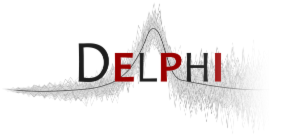
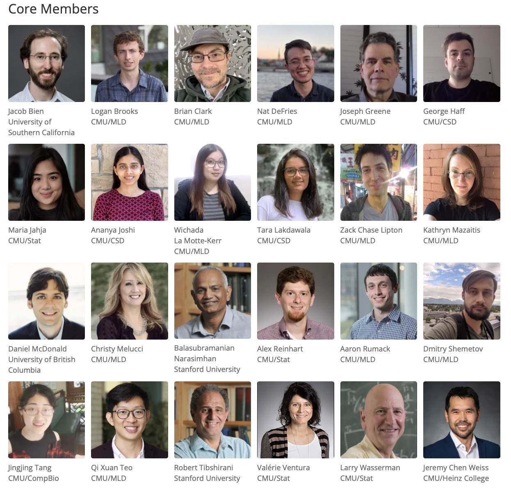

class: middle

```{r setup, include=FALSE}
library(tidyverse)
pro = fontawesome::fa("thumbs-up", fill="green")
con = fontawesome::fa("bomb", fill="red")
options(htmltools.dir.version = FALSE)
knitr::opts_chunk$set(
  fig.width=9, fig.height=3.5, fig.retina=3,
  fig.showtext = TRUE,
  out.width = "100%",
  cache = FALSE,
  echo = TRUE,
  message = FALSE, 
  warning = FALSE,
  hiline = TRUE
)
```

```{r xaringan-themer, include=FALSE, warning=FALSE}
library(xaringanthemer)
primary = "#654ea3"
secondary = "#F9AC2F"
tertiary = "#0076A5"
fourth_color = "#DB0B5B"

style_duo_accent(
  primary_color      = primary,  #"#002145", # UBC primary
  secondary_color    = secondary,  #"6EC4E8", # UBC secondary 4
  header_font_google = google_font("EB Garamond"),
  text_font_google = google_font("Open Sans"),
  code_font_google = google_font("Fira Mono"),
  table_row_even_background_color = lighten_color(primary, 0.8),
  colors = c(
    tertiary = tertiary, fourth_color = fourth_color,
    light_pri = lighten_color(primary, 0.8),
    light_sec = lighten_color(secondary, 0.8),
    light_ter = lighten_color(tertiary, 0.8),
    light_fou = lighten_color(fourth_color, 0.8)
    ),
  title_slide_background_image = "corona.jpeg",
  #title_slide_background_position = "75% 75%",
  #title_slide_background_size = "200px 200px"
  title_slide_text_color = "#FFFFFF"
)
theme_set(theme_xaringan())
```


.pull-left[.center[

]]

.pull-right[.center[



]]


---

## BC COVID Modelling Group

.left-column[

### Personnel

Prof. Dan Coombs

Prof. Sally Otto

Prof. Caroline Colijn

Prof. Dean Karlen

Prof. Eric Cytrynbaum 

Jens von Bergmann

Others 
]

--

.right-column[

### Goals

Mainly volunteers interested and motivated by understanding COVID-19.

Began more as a research group with invited speakers.

Still focused on "understanding" local issues, providing a perspective on the situation that might help policy. 

A focus on counterfactual mathematical modeling.

Strong connection to local/national journalists (esp. Sally and Caroline).

Began releasing reports every other week.

**Big emphasis on data issues/availability**
]

---

## Delphi

### History

* [Delphi](https://delphi.cmu.edu/) Formed in 2012, to "develop theory and practice of epi forecasting".

* Participated in annual CDC influenza forecasting challenges since 2013, and earned top place in several. 

* Awarded **CDC National Center of Excellence** for flu forecasting in 2019.

* Pivoted in February 2020 to focus on supporting the US COVID-19 response, launched [COVIDcast project](https://delphi.cmu.edu/covidcast/).

--

### Goals

**The full pipeline:**

1. Find, collect, disseminate the data we need.
1. Use the data to: model, forecast, nowcast, answer the big questions.
1. Create software for the community.
1. Advance research.
1. Influence policymakers.
1. Communicate broadly.


---

## Delphi personnel

.left-column[
 

**Roni Rosenfeld**  
CMU MLD


**Ryan Tibshirani**  
CMU MLD + Stat
]

--

.center[

]


---

## To understand COVID-19, we need data

.pull-left[
### Canada

`r pro` Centralized Health Care

`r pro` Regularized reporting

`r pro` `r con` Huge emphasis on privacy

]


---
class: inverse, middle, center

# Usage examples

---
## Typography

Text can be **bold**, _italic_, ~~strikethrough~~, or `inline code`.

[Link to another slide](#colors).

### Lorem Ipsum

Dolor imperdiet nostra sapien scelerisque praesent curae metus facilisis dignissim tortor. 
Lacinia neque mollis nascetur neque urna velit bibendum. 
Himenaeos suspendisse leo varius mus risus sagittis aliquet venenatis duis nec.

- Dolor cubilia nostra nunc sodales

- Consectetur .secondary[aliquet] mauris blandit

- Ipsum .primary[dis] .secondary[nec] .tertiary[porttitor] .fourth_color[urna sed]

---
name: colors

## Colors

.left-column[
Text color

[Link Color](#3)

**Bold Color**

_Italic Color_

`Inline Code`
]

.right-column[
Lorem ipsum dolor sit amet, [consectetur adipiscing elit (link)](#3), 
sed do eiusmod tempor incididunt ut labore et dolore magna aliqua. 
Erat nam at lectus urna.
Pellentesque elit ullamcorper **dignissim cras tincidunt (bold)** lobortis feugiat. 
_Eros donec ac odio tempor_ orci dapibus ultrices. 
Id porta nibh venenatis cras sed felis eget velit aliquet.
Aliquam id diam maecenas ultricies mi.
Enim sit amet 
`code_color("inline")`
venenatis urna cursus eget nunc scelerisque viverra.
]

---

# Big Topic or Inverse Slides `#`

## Slide Headings `##`

### Sub-slide Headings `###`

#### Bold Call-Out `####`

This is a normal paragraph text. Only use header levels 1-4.


---

# Left-Column Headings

.left-column[
## First

## Second

## Third
]

.right-column[
Dolor quis aptent mus a dictum ultricies egestas.

Amet egestas neque tempor fermentum proin massa!

Dolor elementum fermentum pharetra lectus arcu pulvinar.
]


---
layout: true

## Blocks

---

### Blockquote

> This is a blockquote following a header.
>
> When something is important enough, you do it even if the odds are not in your favor.

---
layout: true

## Tables

---

```{r}
knitr::kable(head(mtcars), format = 'html')
```

---
exclude: `r if (requireNamespace("DT", quietly=TRUE)) "false" else "true"`

```{r eval=requireNamespace("DT", quietly=TRUE)}
DT::datatable(head(mtcars), fillContainer = FALSE, options = list(pageLength = 4))
```

---
layout: true

## Lists

---

.pull-left[
#### Here is an unordered list:

*   Item foo
*   Item bar
*   Item baz
*   Item zip
]

.pull-right[

#### And an ordered list:

1.  Item one
1.  Item two
1.  Item three
1.  Item four
]

---

### And a nested list:

- level 1 item
  - level 2 item
  - level 2 item
    - level 3 item
    - level 3 item
- level 1 item
  - level 2 item
  - level 2 item
  - level 2 item
- level 1 item
  - level 2 item
  - level 2 item
- level 1 item

---

### Nesting an ol in ul in an ol

- level 1 item (ul)
  1. level 2 item (ol)
  1. level 2 item (ol)
    - level 3 item (ul)
    - level 3 item (ul)
- level 1 item (ul)
  1. level 2 item (ol)
  1. level 2 item (ol)
    - level 3 item (ul)
    - level 3 item (ul)
  1. level 4 item (ol)
  1. level 4 item (ol)
    - level 3 item (ul)
    - level 3 item (ul)
- level 1 item (ul)

---
layout: true

## Plots

---

```{r plot-example, eval=requireNamespace("ggplot2", quietly=TRUE)}
library(ggplot2)
(g <- ggplot(mpg) + aes(hwy, cty, color = class) + geom_point())
```

---

```{r plot-example-themed, }
g + 
  xaringanthemer::theme_xaringan(text_font_size = 16, title_font_size = 18) +
  ggtitle("A Plot About Cars")
```

---
layout: false

## Square image

<center></center>

.footnote[GitHub Octocat]

---

### Wide image


.footnote[Wide images scale to 100% slide width]

---

## Two images

.pull-left[

]

.pull-right[

]

---

### Definition lists can be used with HTML syntax.

<dl>
<dt>Name</dt>
<dd>Godzilla</dd>
<dt>Born</dt>
<dd>1952</dd>
<dt>Birthplace</dt>
<dd>Japan</dd>
<dt>Color</dt>
<dd>Green</dd>
</dl>

---
class: center, middle

# Thanks!

Slides created via the R packages:

[**xaringan**](https://github.com/yihui/xaringan)<br>
[gadenbuie/xaringanthemer](https://github.com/gadenbuie/xaringanthemer)

The chakra comes from [remark.js](https://remarkjs.com), [**knitr**](http://yihui.name/knitr), and [R Markdown](https://rmarkdown.rstudio.com).
